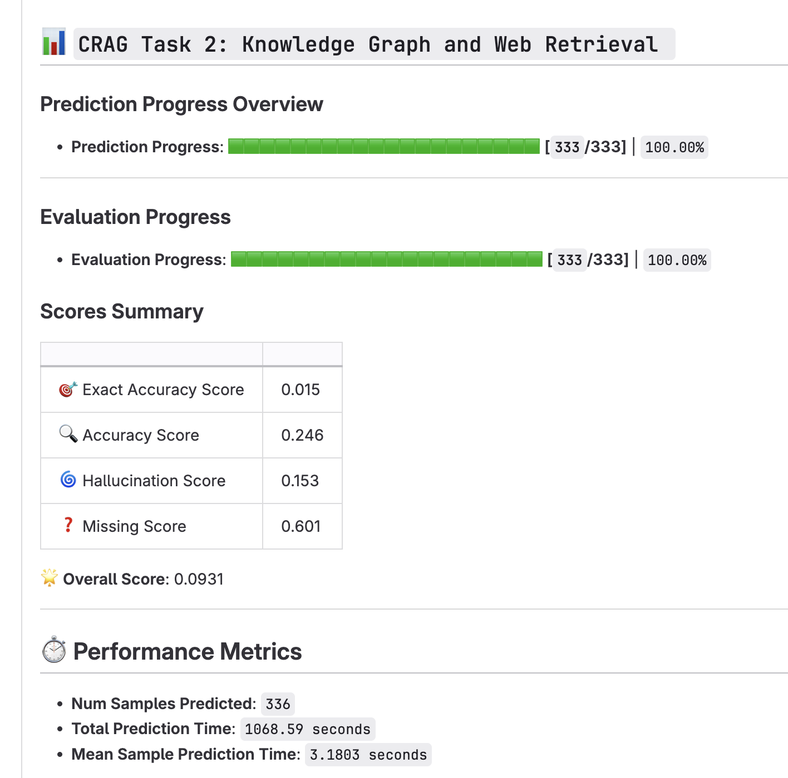

## [meta-comprehensive-rag-benchmark-kdd-cup-2024](https://www.aicrowd.com/challenges/meta-comprehensive-rag-benchmark-kdd-cup-2024)


<p align="center">
  
  
  
</p>


### 1、代码结构

```text
.
├── Dockerfile
├── README.md
├── bm25_retriever.py
├── build.sh
├── config.py
├── data
│   ├── result.json
│   ├── test_question.json
│   └── train_a.pdf
├── faiss_retriever.py
├── vllm_model.py
├── pdf_parse.py
├── pre_train_model
│   ├── Qwen-7B-Chat
│   │   └── download.py
│   ├── bge-reranker-large
│   └── m3e-large
├── qwen_generation_utils.py
├── requirements.txt
├── rerank_model.py
├── run.py
├── run.sh
└── vllm_wrapper.py
```

### 2、[Introduction](https://www.aicrowd.com/challenges/meta-comprehensive-rag-benchmark-kdd-cup-2024)
#### 2.1 This challenge comprises of three tasks designed to improve question-answering (QA) systems.

TASK #1: WEB-BASED RETRIEVAL SUMMARIZATION Participants receive 5 web pages per question, potentially containing relevant information. The objective is to measure the systems' capability to identify and condense this information into accurate answers.

TASK #2: KNOWLEDGE GRAPH AND WEB AUGMENTATION This task introduces mock APIs to access information from underlying mock Knowledge Graphs (KGs), with structured data possibly related to the questions. Participants use mock APIs, inputting parameters derived from the questions, to retrieve relevant data for answer formulation. The evaluation focuses on the systems' ability to query structured data and integrate information from various sources into comprehensive answers.

TASK #3: END-TO-END RAG The third task increases complexity by providing 50 web pages and mock API access for each question, encountering both relevant information and noises. It assesses the systems' skill in selecting the most important data from a larger set, reflecting the challenges of real-world information retrieval and integration.


query: how many 3-point attempts did steve nash average per game in seasons he made the 50-40-90 club?
answer: 4 3-points attempts per game

query: where did  the ceo of salesforce previously work?
answer: marc benioff spent 13 years at oracle, before launching   salesforce.


#### 2.2  CRAG Dataset Description

#### 📝 QUESTION ANSWER PAIRS

CRAG includes question-answer pairs that mirror real scenarios. It covers five domains: Finance, Sports, Music, Movies, and Encyclopedia Open domain. These domains represent the spectrum of information change rates—rapid (Finance and Sports), gradual (Music and Movies), and stable (Open domain).

CRAG includes eight types of questions in English:

Simple question: Questions asking for simple facts, such as the birth date of a person and the authors of a book.
Simple question with some condition: Questions asking for simple facts with some given conditions, such as stock price on a certain date and a director's recent movies in a certain genre.
Set question Questions that expect a set of entities or objects as the answer. An example is what are the continents in the southern hemisphere?
Comparison question: Questions that may compare two entities, such as who started performing earlier, Adele or Ed Sheeran?
Aggregation question: Questions that may need aggregation of retrieval results to answer, for example, how many Oscar awards did Meryl Streep win?
Multi-hop questions: Questions that may require chaining multiple pieces of information to compose the answer, such as who acted in Ang Lee's latest movie?
Post-processing question: Questions that need reasoning or processing of the retrieved information to obtain the answer, for instance, How many days did Thurgood Marshall serve as a Supreme Court justice?
False Premise question: Questions that have a false preposition or assumption; for example, What's the name of Taylor Swift's rap album before she transitioned to pop? (Taylor Swift didn't release any rap album.)

#### 📁 RETRIEVAL CONTENTS

The dataset includes web search results and mock KGs to mimic real-world RAG retrieval sources. Web search contents were created by storing up to 50 pages from search queries related to each question. Mock KGs were created using the data behind the questions, supplemented with "hard negative" data to simulate a more challenging retrieval environment. Mock APIs facilitate structured searches within these KGs, and we provide the same API for all five domains to simulate Knowledge Graph access.

#### [CRAG Dataset Documentation](https://gitlab.aicrowd.com/aicrowd/challenges/meta-comprehensive-rag-benchmark-kdd-cup-2024/meta-comphrehensive-rag-benchmark-starter-kit/-/blob/master/docs/dataset.md)

### 3、Solution

#### 3.1 Web page parser

##### 3.1.1 pdf分块解析

如图所示，我们希望pdf解析能尽可能的按照快状进行解析，每一块当做一个样本，这样能尽可能的保证pdf中文本内容的完整性
改进==》希望借助OCR进行pdf的块状识别

##### 3.1.2 pdf 滑窗法解析


如图1,2 所示，我们可以看到图1和图2上下文是连续的，如何保证文本内容的跨页连续性问题，我们提出滑窗法。
具体的把pdf中所有内容当做一个字符串来处理，按照句号进行分割，根据分割后的数组进行滑窗。具体的如下所示:

["aa","bb","cc","dd"]

如果字符串长度为4, 经过滑窗后的结果如下:

aabb

bbcc

ccdd

我们希望滑窗法像卷积一样可以不同的kernel,Stride,来寻找能覆盖到的最优的样本召回

#### 3.2 召回

召回主要使用langchain中的retrievers进行文本的召回。我们知道向量召回和bm25召回具有互补性，因此选用了这两个进行召回

##### 3.2.1 向量召回

向量召回利用 FAISS 进行索引创建和查找，embedding 利用 [M3E-large](https://modelscope.cn/models/Jerry0/M3E-large/summary) 或者[bge-large-zh](https://modelscope.cn/models/AI-ModelScope/bge-large-zh/summary)

##### 3.2.2 bm25召回

bm25召回利用 langchain自带的bm25 retrievers

#### 3.3 重排序

1、重排序是对召回的文本进行进一步的重排，以获得更精准，数据量更少的可能答案。
2、向量召回中使用的是bi-encoder结构，而bge-reranker-large 使用的是 cross-encoder结构，cross-encoder结构一定程度上要优于bi-encoder

##### 3.3.1 cross-encoder

重排序此处使用了 [bge-reranker-large](https://modelscope.cn/models/Xorbits/bge-reranker-large/files)

#### 3.4 推理优化

##### 3.4.1 vllm batch

vllm 利用page attention 技术使推理速度得到提升，batch推理比普通推理有接近1倍的提升空间

##### 3.4.2 tensorRT-LLM

tensorRT-LLM是英伟达推出的推理框架,并且提供了c++和python的调用方式。关于qwen的tensorRT-LLM使用请参考官方介绍[tensorRT-LLM Qwen](https://github.com/NVIDIA/TensorRT-LLM/tree/main/examples/qwen)

### 4、排名

[初赛2名](https://tianchi.aliyun.com/competition/entrance/532154/rankingList)
[复赛13名](https://tianchi.aliyun.com/competition/entrance/532154/rankingList)
