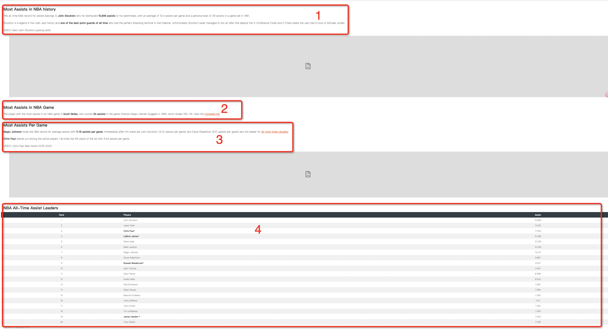
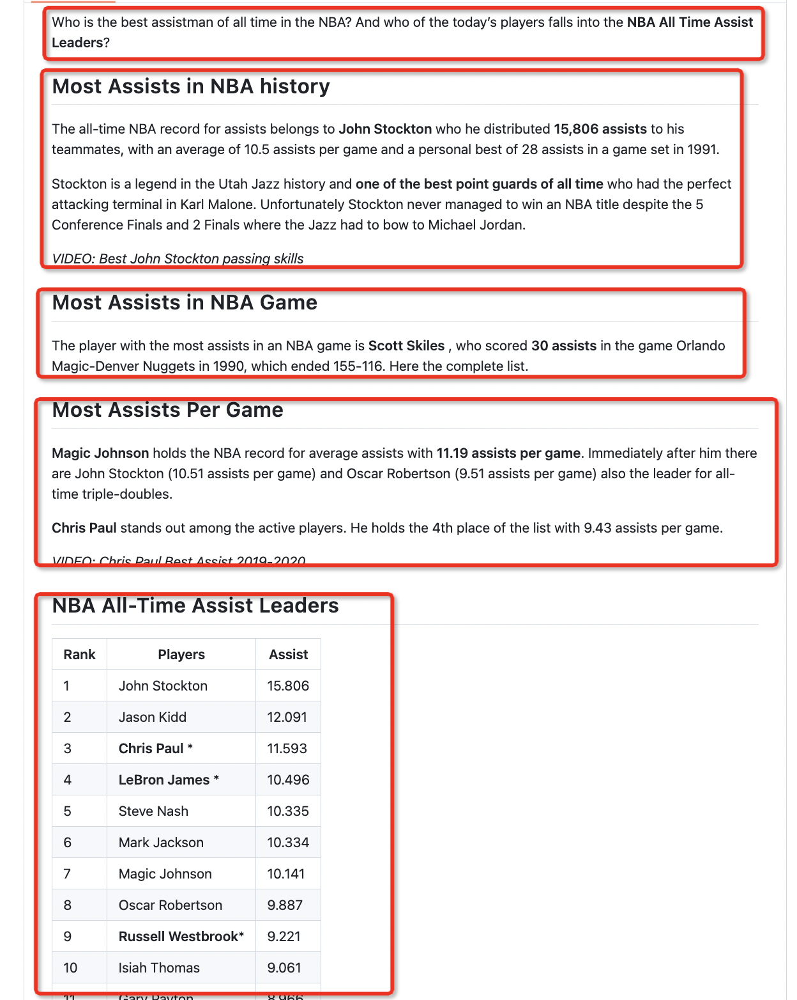

## [meta-comprehensive-rag-benchmark-kdd-cup-2024](https://www.aicrowd.com/challenges/meta-comprehensive-rag-benchmark-kdd-cup-2024)


<p align="center">
  
  
  
</p>


### 1、code struct

```text
.
├── README.md
├── data
│   └── dev_data.jsonl.bz2
├── images
├── local_evaluation.py
├── models
│   ├── bm25_retriever.py
│   ├── faiss_retriever.py
│   ├── main_content_extractor.py
│   ├── rag_llama_baseline.py
│   ├── rerank_model.py
│   ├── stopwords.txt
│   ├── trafilatura_extends.py
│   ├── user_config.py
│   └── utils.py
├── pretrained_model
│   ├── bge-rerank
│   ├── gte-large-en
│   └── llama3-8b
├── prompts
│   └── templates.py
├── requirements.txt
└── tokenizer
```

### 2、[Introduction](https://www.aicrowd.com/challenges/meta-comprehensive-rag-benchmark-kdd-cup-2024)
#### 2.1 This challenge comprises of three tasks designed to improve question-answering (QA) systems.

TASK #1: WEB-BASED RETRIEVAL SUMMARIZATION Participants receive 5 web pages per question, potentially containing relevant information. The objective is to measure the systems' capability to identify and condense this information into accurate answers.

TASK #2: KNOWLEDGE GRAPH AND WEB AUGMENTATION This task introduces mock APIs to access information from underlying mock Knowledge Graphs (KGs), with structured data possibly related to the questions. Participants use mock APIs, inputting parameters derived from the questions, to retrieve relevant data for answer formulation. The evaluation focuses on the systems' ability to query structured data and integrate information from various sources into comprehensive answers.

TASK #3: END-TO-END RAG The third task increases complexity by providing 50 web pages and mock API access for each question, encountering both relevant information and noises. It assesses the systems' skill in selecting the most important data from a larger set, reflecting the challenges of real-world information retrieval and integration.


query: how many 3-point attempts did steve nash average per game in seasons he made the 50-40-90 club?
answer: 4 3-points attempts per game

query: where did  the ceo of salesforce previously work?
answer: marc benioff spent 13 years at oracle, before launching   salesforce.


#### 2.2  CRAG Dataset Description

#### 📝 QUESTION ANSWER PAIRS

CRAG includes question-answer pairs that mirror real scenarios. It covers five domains: Finance, Sports, Music, Movies, and Encyclopedia Open domain. These domains represent the spectrum of information change rates—rapid (Finance and Sports), gradual (Music and Movies), and stable (Open domain).

CRAG includes eight types of questions in English:

Simple question: Questions asking for simple facts, such as the birth date of a person and the authors of a book.
Simple question with some condition: Questions asking for simple facts with some given conditions, such as stock price on a certain date and a director's recent movies in a certain genre.
Set question Questions that expect a set of entities or objects as the answer. An example is what are the continents in the southern hemisphere?
Comparison question: Questions that may compare two entities, such as who started performing earlier, Adele or Ed Sheeran?
Aggregation question: Questions that may need aggregation of retrieval results to answer, for example, how many Oscar awards did Meryl Streep win?
Multi-hop questions: Questions that may require chaining multiple pieces of information to compose the answer, such as who acted in Ang Lee's latest movie?
Post-processing question: Questions that need reasoning or processing of the retrieved information to obtain the answer, for instance, How many days did Thurgood Marshall serve as a Supreme Court justice?
False Premise question: Questions that have a false preposition or assumption; for example, What's the name of Taylor Swift's rap album before she transitioned to pop? (Taylor Swift didn't release any rap album.)

#### 📁 RETRIEVAL CONTENTS

The dataset includes web search results and mock KGs to mimic real-world RAG retrieval sources. Web search contents were created by storing up to 50 pages from search queries related to each question. Mock KGs were created using the data behind the questions, supplemented with "hard negative" data to simulate a more challenging retrieval environment. Mock APIs facilitate structured searches within these KGs, and we provide the same API for all five domains to simulate Knowledge Graph access.

#### [CRAG Dataset Documentation](https://gitlab.aicrowd.com/aicrowd/challenges/meta-comprehensive-rag-benchmark-kdd-cup-2024/meta-comphrehensive-rag-benchmark-starter-kit/-/blob/master/docs/dataset.md)

### 3、Solution

#### 3.1 Web page parser

##### 3.1.1  Web page divide into sections based on titles
[web page url](https://www.dunkest.com/en/nba/news/14294/nba-assist-record-all-time-leaders)



#####  We use the main content analysis function to parser the web page that can obtain the core content, the parser can get the markdown format data, like this:



##### You can use the models/main_content_extractor.py code to parser the page html

```python

url = "https://www.dunkest.com/en/nba/news/14294/nba-assist-record-all-time-leaders"
response = requests.get(url)
response.encoding = 'utf-8'
content = response.text
start = time.perf_counter()

# Get HTML with main content extracted from HTML
extracted_html = MainContentExtractor.extract(content)

# Get HTML with main content extracted from Markdown
extracted_markdown = MainContentExtractor.extract(content, include_links = False, output_format="markdown")

end = time.perf_counter()

# program time cost
elapsed = end - start
print(f"time cost: {elapsed} / millisecond\n")
print(extracted_markdown)

```

#### 3.2 Retriever

We use vector retriever and bm25 retriever


##### 3.2.1 vector retriever

[Alibaba-NLP/gte-large-en-v1.5](https://huggingface.co/Alibaba-NLP/gte-large-en-v1.5)

##### 3.2.2 bm25 retriever


#### 3.3 Rerank

##### 3.3.1 cross-encoder

[BAAI/bge-reranker-v2-gemma](https://huggingface.co/BAAI/bge-reranker-v2-gemma)

#### 3.4 inference

##### 3.4.1 vllm batch

[vllm](https://github.com/vllm-project/vllm)

### 4、rank

[phase1 task1 3](https://www.aicrowd.com/challenges/meta-comprehensive-rag-benchmark-kdd-cup-2024/problems/meta-kdd-cup-24-crag-retrieval-summarization/leaderboards)
[phase2]()
